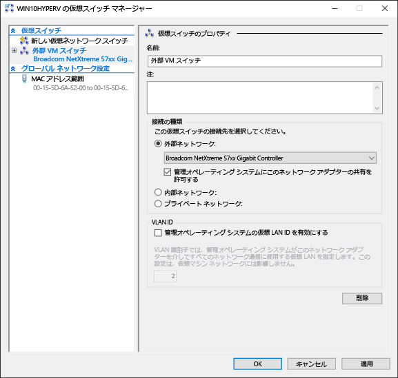

# <a name="create-a-virtual-network"></a>仮想ネットワークを作成する

仮想マシンでは、ネットワークをコンピューターと共有するための仮想ネットワークが必要になります。  仮想ネットワークの作成は必要に応じて実行できます。仮想マシンをインターネットやネットワークに接続する必要がない場合は、この後にある「[Windows 仮想マシンの作成](create-virtual-machine.md)」をご覧ください。


## <a name="connect-virtual-machines-to-the-internet"></a>仮想マシンをインターネットに接続する

Hyper-V には、外部、内部、プライベートの 3 種類の仮想スイッチがあります。 コンピューターのネットワークを、そのネットワーク上で実行されている仮想マシンと共有するには、外部スイッチを作成します。

この演習では、外部仮想スイッチを作成する手順について説明します。 この演習が完了すると、Hyper-V ホストに仮想スイッチが構成されます。この仮想スイッチによって、仮想マシンはコンピューターのネットワーク接続を経由してインターネットに接続することができます。 

### <a name="create-a-virtual-switch-with-hyper-v-manager"></a>Hyper-V マネージャーで仮想スイッチを作成する

1. Hyper-V マネージャーを開きます。  これをすばやく行うには、Windows ボタンまたは Windows キーを押してから、「Hyper-V マネージャー」と入力します。  
検索で Hyper-V マネージャーが見つからない場合、Hyper-V または Hyper-V 管理ツールが有効になっていません。  [Hyper-V を有効にする](enable-hyper-v.md)手順をご覧ください。

2. 左側のウィンドウでサーバーを選ぶか、右側のウィンドウで [サーバーに接続...] をクリックします。

3. Hyper-V マネージャーで、右側の [操作] メニューから **[仮想スイッチ マネージャー]** を選択します。 

4. [仮想スイッチ] セクションで、**[新しい仮想ネットワーク スイッチ]** を選択します。

5. [どの種類の仮想スイッチを作成しますか] で、**[外部]** を選択します。

6. **[仮想スイッチの作成]** ボタンを選択します。

7. [仮想スイッチのプロパティ] で、**External VM Switch** のような名前を新しいスイッチに付けます。

8. [接続の種類] で、**[外部ネットワーク]** が選択されていることを確認します。

9. 新しい仮想スイッチと組み合わせて使用する物理ネットワーク カードを選択します。 これは、ネットワークに物理的に接続されているネットワーク カードです。  

    

10. **[適用]** を選択し、仮想スイッチを作成します。 この時点で、通常は、次のようなメッセージが表示されます。 **[はい]** をクリックして続行します。

      

11. **[OK]** を選択し、仮想スイッチ マネージャーのウィンドウを閉じます。


### <a name="create-a-virtual-switch-with-powershell"></a>PowerShell で仮想スイッチを作成する

次の手順は、PowerShell を使用して仮想スイッチと外部接続を作成する際に使用されます。 

1. **Get-NetAdapter** を使用し、Windows 10 システムに接続されているネットワーク アダプターの一覧を取得します。

    ```powershell
    PS C:\> Get-NetAdapter

    Name                      InterfaceDescription                    ifIndex Status       MacAddress             LinkSpeed
    ----                      --------------------                    ------- ------       ----------             ---------
    Ethernet 2                Broadcom NetXtreme 57xx Gigabit Cont...       5 Up           BC-30-5B-A8-C1-7F         1 Gbps
    Ethernet                  Intel(R) PRO/100 M Desktop Adapter            3 Up           00-0E-0C-A8-DC-31        10 Mbps  
    ```

2. Hyper-V スイッチで使用するネットワーク アダプターを選択し、**$net** という名前の変数にインスタンスを指定します。

    ```
    $net = Get-NetAdapter -Name 'Ethernet'
    ```

3. 次のコマンドを実行し、新しい Hyper-V 仮想スイッチを作成します。

    ```
    New-VMSwitch -Name "External VM Switch" -AllowManagementOS $True -NetAdapterName $net.Name
    ```

## <a name="virtual-networking-on-a-laptop"></a>ノート PC での仮想ネットワーク

### <a name="nat-networking"></a>NAT ネットワーク
ネットワーク アドレス変換 (NAT) を利用すると、仮想マシンは、ホスト コンピューターの IP アドレスと内部 Hyper-V 仮想スイッチを経由するポートを組み合わせることによってコンピューターのネットワークにアクセスすることができます。

これには、便利な特徴がいくつかあります。
1. NAT では、外部 IP アドレスとポートをより大きな内部 IP アドレスのセットにマッピングすることで IP アドレスを節約します。 
2. NAT を利用すると、同じ (内部) 通信ポートを必要とするアプリケーションを一意の外部ポートにマッピングすることで、複数の仮想マシンがこれらのアプリケーションをホストできるようになります。
3. NAT では内部スイッチを使用します。内部スイッチを作成しても、ネットワーク接続を使用することはありません。また、コンピューターのネットワークに干渉することもほとんどありません。

NAT ネットワークをセットアップして、仮想マシンに接続するには、[NAT ネットワークのユーザー ガイド](../user-guide/setup-nat-network.md)の手順に従ってください。

### <a name="the-two-switch-approach"></a>2 つのネットワークを切り替える方法
ノート PC で Windows 10 Hyper-V を実行しており、ワイヤレス (無線) ネットワークとワイヤード (有線) ネットワークを切り替えることが頻繁にある場合、イーサネットとワイヤレス ネットワーク カードの両方に対応した仮想スイッチを作成することができます。 この構成では、ネットワークへのノート PC の接続方法に応じて、これらのスイッチ間の仮想マシンを変更することができます。 仮想マシンが有線と無線を自動で切り替えることはありません。


## <a name="next-step---create-a-virtual-machine"></a>次の手順 - 仮想マシンを作成する
[Windows 仮想マシンを作成する](create-virtual-machine.md)
