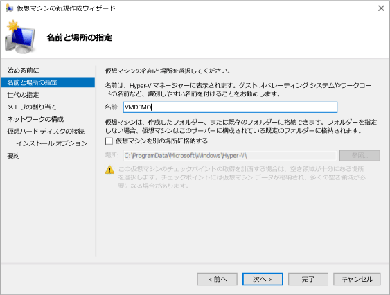
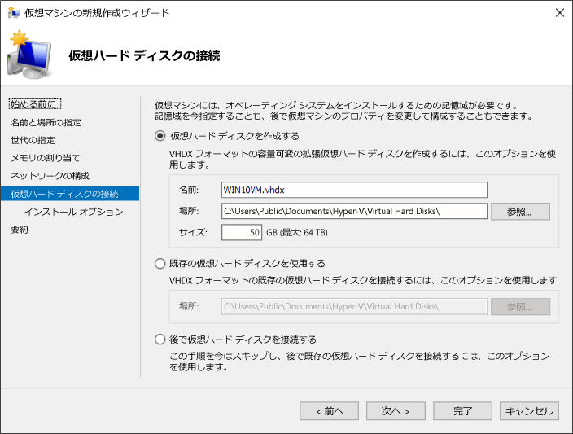
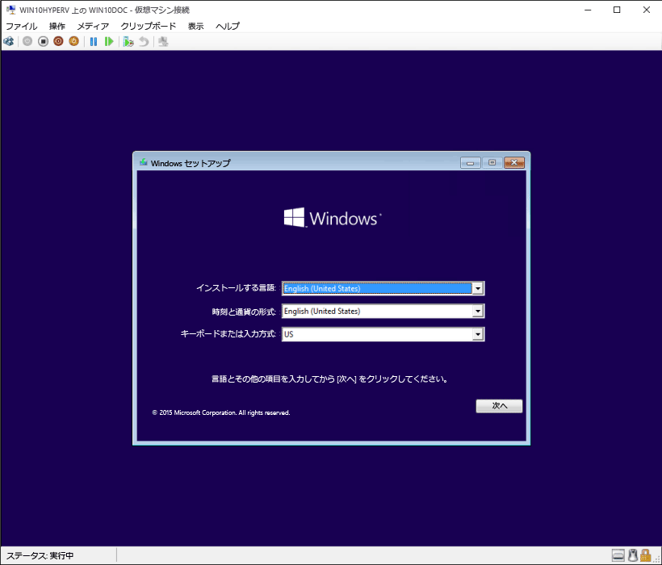

# <a name="create-virtual-machine-with-hyper-v-on-windows-10"></a>Windows 10 での Hyper-V による仮想マシンの作成

仮想マシンを作成し、新しい仮想マシンでオペレーティング システムをインストールする方法について説明します。  実行するオペレーティング システムの .iso ファイルが必要です。 必要な場合は、[TechNet Evaluation Center](http://www.microsoft.com/en-us/evalcenter/) から Windows 10 の評価版を取得します。

## <a name="create-a-virtual-machine-with-hyper-v-manager"></a>Hyper-V マネージャーでの仮想マシンの作成

1. Windows キーを押して「Hyper-V マネージャー」と入力するか、アプリケーションの一覧で **[Hyper-V マネージャー]** を見つけて、Hyper-V マネージャーを開きます。

2. Hyper-V マネージャーで、**[アクション]** > **[新規]** > **[仮想マシン]** の順にクリックし、新しい仮想マシン ウィザードを表示します。

2. [始める前に] のコンテンツを確認して、**[次へ]** をクリックします。 

3. 仮想マシンに名前を付けます。
  > **注:** この名前は、Hyper-V が仮想マシンに使用する名前であり、仮想マシン内に展開されるゲスト オペレーティング システムに指定されるコンピューター名ではありません。

4. 仮想マシン ファイルが格納される場所を選択します (**c:\virtualmachine** など)。 既定の場所を受け入れることもできます。 完了したら、**[次へ]** をクリックします。
    
  

5. マシンの世代を選択し、**[次へ]** をクリックします。  

  第 2 世代仮想マシンは、Windows Server 2012 R2 で導入されており、簡略化された仮想ハードウェア モデルといくつかの追加機能を提供します。 第 2 世代の仮想マシンには、64 ビット オペレーティング システムのみをインストールできます。 第 2 世代仮想マシンの詳細については、「[第 2 世代仮想マシンの概要](https://technet.microsoft.com/en-us/library/dn282285.aspx)」をご覧ください。
  
  > 新しい仮想マシンが第 2 世代として構成されている場合、Linux ディストリビューションを実行するには、セキュア ブートを無効にする必要があります。 セキュア ブートの詳細については、「[セキュア ブート](https://technet.microsoft.com/en-us/library/dn486875.aspx)」をご覧ください。

6. **[起動メモリ]** の値として **[2048]** MB を選択し、**[動的メモリを使用します]** が選択されたままにします。 **[次へ]** をクリックします。  

  メモリは、Hyper-V ホストとホスト上で実行されている仮想マシンの間で共有されます。 1 つのホスト上で実行できる仮想マシンの数は、使用可能なメモリにも依存します。 また、仮想マシンは動的メモリを使用するように、構成することもできます。 有効にすると、動的メモリは実行中の仮想マシンから未使用のメモリを解放します。 解放すると、より多くの仮想マシンをホスト上で実行できます。 動的メモリの詳細については、「[Hyper-V 動的メモリの概要](https://technet.microsoft.com/en-us/library/hh831766.aspx)」をご覧ください。

7. ネットワークの構成ウィザードで、仮想マシン用の仮想スイッチを選択し、**[次へ]** をクリックします。 詳細については、「[仮想スイッチを作成する](connect-to-network.md)」をご覧ください。

8. 仮想ハード ドライブに名前を付け、場所を選択するか既定のままにして、最後にサイズを指定します。 準備ができたら、**[次へ]** をクリックします。

  仮想ハード ドライブは、物理ハード ドライブと同様に仮想マシンの記憶域を提供します。 仮想マシンにオペレーティング システムをインストールできるようにするには、仮想ハード ドライブが必要です。
  
    

9. インストール オプション ウィザードで、**[ブート イメージ ファイルからオペレーティング システムをインストールする]** を選択して、オペレーティング システムの .iso ファイルを選択します。 完了したら、**[次へ]** をクリックします。

  仮想マシンの作成中に、いくつかのオペレーティング システムのインストール オプションを構成できます。 次の 3 つのオプションを使用できます。

  - **後でオペレーティング システムをインストールする** – このオプションは、仮想マシンに追加の構成変更を行いません。

  - **ブート イメージ ファイルからオペレーティング システムをインストールする** – これは物理コンピューターの物理的な CD-ROM ドライブに CD を挿入するのと似ています。 このオプションを構成するには、.iso イメージを選択します。 このイメージは、仮想マシンの仮想 CD-ROM ドライブにマウントされます。 仮想マシンのブート順は、CD-ROM ドライブから最初にブートされるように変更されます。

  - **ネットワーク ベースのインストール サーバーからオペレーティング システムをインストールする** – このオプションは、ネットワーク スイッチに仮想マシンを接続しない限り使用できません。 この構成では、仮想マシンはネットワークからブートを試行します。
  
10. 仮想マシンの詳細を確認し、**[完了]** をクリックして仮想マシンの作成を完了します。

## <a name="create-a-virtual-machine-with-powershell"></a>PowerShell での仮想スイッチの作成

1. 管理者として PowerShell ISE を開きます。

2. 以下のコマンドを実行します。

  ```powershell
  # Set VM Name, Switch Name, and Installation Media Path.
  $VMName = 'TESTVM'
  $Switch = 'External VM Switch'
  $InstallMedia = 'C:\Users\Administrator\Desktop\en_windows_10_enterprise_x64_dvd_6851151.iso'
  
  # Create New Virtual Machine
  New-VM -Name $VMName -MemoryStartupBytes 2147483648 -Generation 2 -NewVHDPath "D:\Virtual Machines\$VMName\$VMName.vhdx" -NewVHDSizeBytes 53687091200 -Path "D:\Virtual Machines\$VMName" -SwitchName $Switch
  
  # Add DVD Drive to Virtual Machine
  Add-VMScsiController -VMName $VMName
  Add-VMDvdDrive -VMName $VMName -ControllerNumber 1 -ControllerLocation 0 -Path $InstallMedia
  
  # Mount Installation Media
  $DVDDrive = Get-VMDvdDrive -VMName $VMName
  
  # Configure Virtual Machine to Boot from DVD
  Set-VMFirmware -VMName $VMName -FirstBootDevice $DVDDrive
  ```
  
## <a name="complete-the-operating-system-deployment"></a>オペレーティング システムの展開を完了する

仮想マシンの構築を完了するには、仮想マシンを起動して、オペレーティング システムのインストールを行う必要があります。

1. Hyper-V マネージャーで、仮想マシンをダブルクリックします。 VMConnect ツールが起動されます。

2. VMConnect で、緑色の [スタート] ボタンをクリックします。 これは物理コンピューター上の電源ボタンを押すのと似ています。 "CD または DVD からブートするには、いずれかのキーを押してください" というメッセージが表示される場合があります。 そのように押してください。
  > **注:** VMConnect ウィンドウ内をクリックして、キーストロークが仮想マシンに送信されていることを確認することをお勧めします。

3. 仮想マシンでセットアップが起動され、物理コンピューターと同じように、インストールを行うことができます。

   

> **注:** ボリューム ライセンス版の Windows を実行していない限り、仮想マシン内で実行されている Windows のライセンスを区別する必要があります。 仮想マシンのオペレーティング システムは、ホストのオペレーティング システムに依存しません。
