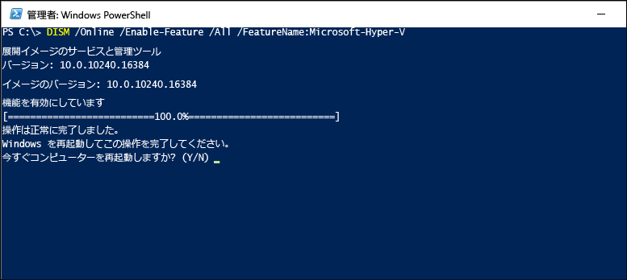
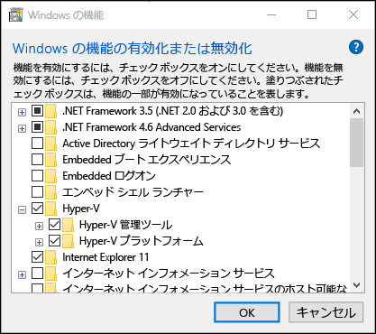

# <a name="install-hyper-v-on-windows-10"></a>Windows 10 上に Hyper-V をインストールする

Windows 10 上に仮想マシンを作成するには、Hyper-V を有効にします。  
Hyper-V はさまざまな方法で有効にすることができます。たとえば、Windows 10 のコントロール パネルや PowerShell を使用したり、デプロイ イメージのサービスと管理 (DISM) ツールを使用する方法などがあります。 このドキュメントでは、それぞれの方法について説明します。

> **注:** Hyper-V はオプション機能として Windows に組み込まれています。Hyper-V を単体でダウンロードすることはできません。

## <a name="check-requirements"></a>要件の確認

* Windows 10 Enterprise、Pro、または Education
* 第 2 レベルのアドレス変換 (SLAT) の 64 ビット プロセッサ。
* VM モニター モード拡張機能 (Intel CPU の VT-c) の CPU サポート
* 最小 4 GB のメモリ。

Hyper-V ロールは、Windows 10 Home にはインストール**できません**。

**[設定]**  >  **[更新とセキュリティ]**  >  **[ライセンス認証]** の順に移動して、Windows 10 Home Edition を Windows 10 Pro にアップグレードしてください。

詳しい情報とトラブルシューティングについては、「[Windows 10 Hyper-V のシステム要件](../reference/hyper-v-requirements.md)」をご覧ください。

## <a name="enable-hyper-v-using-powershell"></a>PowerShell を使用して Hyper-V を有効にする

1. 管理者として PowerShell コンソールを開きます。

2. 次に、

  ```powershell
  Enable-WindowsOptionalFeature -Online -FeatureName Microsoft-Hyper-V -All
  ```

  コマンドが見つからなかった場合は、管理者として PowerShell を実行していることを確認してください。

インストールが完了したら、再起動します。

## <a name="enable-hyper-v-with-cmd-and-dism"></a>CMD と DISM を使用して Hyper-V を有効にする

展開イメージのサービスと管理 (DISM) ツール を使用して、Windows と Windows イメージを構成できます。  さまざまなアプリケーションがありますが、DISM では、オペレーティング システムの実行中に Windows の機能を有効にすることができます。

DISM を使用して Hyper-V ロールを有効にするには:

1. 管理者として PowerShell または CMD セッションを開きます。

1. 次のコマンドを入力します。

  ```powershell
  DISM /Online /Enable-Feature /All /FeatureName:Microsoft-Hyper-V
  ```

  

DISM について詳しくは、[DISM のテクニカル リファレンス](<https://docs.microsoft.com/previous-versions/windows/it-pro/windows-8.1-and-8/hh824821(v=win.10)>)をご覧ください。

## <a name="enable-the-hyper-v-role-through-settings"></a>[設定] で Hyper-V ロールを有効にする

1. Windows ボタンを右クリックし、[アプリと機能] を選択します。

2. 右側の関連する設定にある **[プログラムと機能]** を選択します。 

3. **[Windows の機能の有効化または無効化]** を選択します。

4. **[Hyper-V]** を選択して、 **[OK]** をクリックします。



インストールが完了すると、コンピューターの再起動を促すメッセージが表示されます。

## <a name="make-virtual-machines"></a>仮想マシンを作成する

[最初の仮想マシンを作成する](quick-create-virtual-machine.md)
