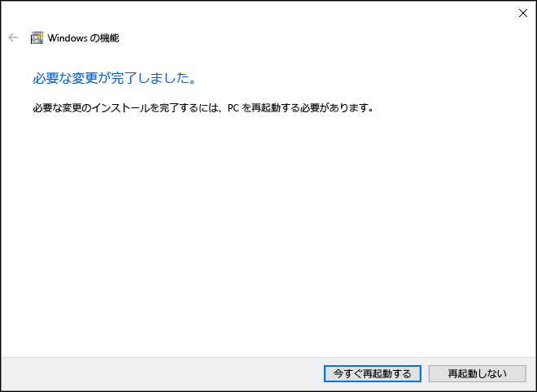

# Windows 10 上に Hyper-V をインストールする

Windows 10 上に仮想マシンを作成するには、Hyper-V を有効にします。  
Hyper-V はさまざまな方法で有効にすることができます。たとえば、Windows 10 のコントロール パネルや PowerShell (私のお気に入りの方法です) を使用したり、展開イメージのサービスと管理 (DISM) ツールを使用する方法などがあります。 このドキュメントでは、それぞれの方法について説明します。

> **注:** Hyper-V はオプション機能として Windows に組み込まれています。Hyper-V のダウンロードやインストール可能なコンポーネントはありません。 

## 要件の確認

* Windows 10 Enterprise、Professional、または Education
* 第 2 レベルのアドレス変換 (SLAT) の 64 ビット プロセッサ。
* VM モニター モード拡張機能 (Intel CPU の VT-c) の CPU サポート
* 最小 4 GB のメモリ。

Hyper-V ロールは、Windows 10 Home にはインストール**できません**。  
**[設定]** > **[更新とセキュリティ]** > **[ライセンス認証]** の順に移動して、Windows 10 Home エディションを Windows 10 Professional にアップグレードしてください。

詳しい情報とトラブルシューティングについては、「[Windows 10 Hyper-V のシステム要件](../reference/hyper-v-requirements.md)」をご覧ください。


## Hyper-V をインストールする 
Hyper-V はオプション機能として Windows に組み込まれています。Hyper-V のダウンロードやインストール可能なコンポーネントはありません。  組み込まれている Hyper-V ロールを有効にするには、いくつかの方法があります。

### PowerShell を使用して Hyper-V を有効にする

1. 管理者として PowerShell コンソールを開きます。

2. 次のコマンドを実行します。
  ```powershell
  Enable-WindowsOptionalFeature -Online -FeatureName:Microsoft-Hyper-V -All
  ```  

  コマンドが見つからなかった場合は、管理者として PowerShell を実行していることを確認してください。  

インストールが完了すると、コンピューターを再起動する必要があります。  

### CMD と DISM を使用して Hyper-V を有効にする

展開イメージのサービスと管理 (DISM) ツール を使用して、Windows と Windows イメージを構成できます。  さまざまなアプリケーションがありますが、DISM では、オペレーティング システムの実行中に Windows の機能を有効にすることができます。  

DISM を使用して Hyper-V ロールを有効にするには:
1. 管理者として PowerShell または CMD セッションを開きます。

2. 次のコマンドを入力します。  
  ```powershell
  DISM /Online /Enable-Feature /All /FeatureName:Microsoft-Hyper-V
  ```  
  

DISM について詳しくは、[DISM のテクニカル リファレンス](https://technet.microsoft.com/en-us/library/hh824821.aspx)をご覧ください。

### 手動で Hyper-V ロールをインストールする

1. Windows ボタンを右クリックし、[プログラムと機能] を選択します。

2. **[Windows の機能の有効化または無効化]** を選択します。

3. **[Hyper-V]** を選択して、**[OK]** をクリックします。  


インストールが完了すると、コンピューターを再起動するメッセージが表示されます。




## 仮想マシンを作成する
[最初の仮想マシンを作成する](quick-create-virtual-machine.md)
