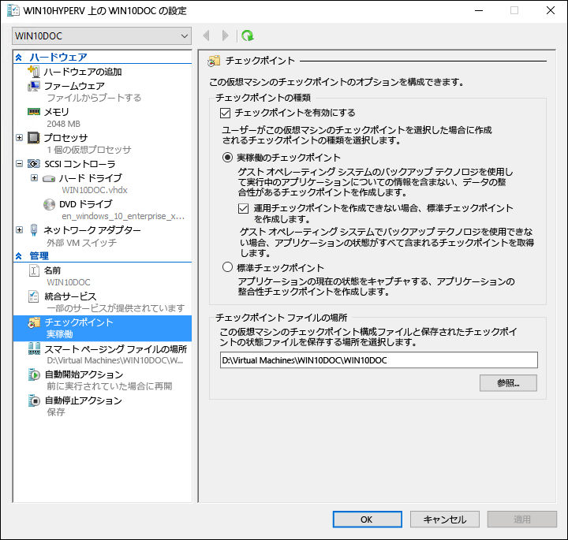
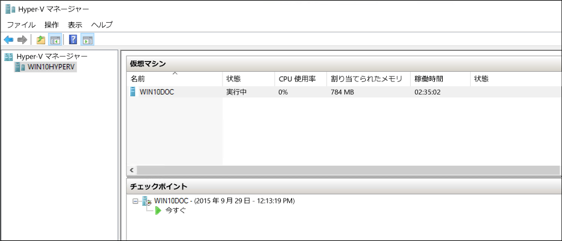
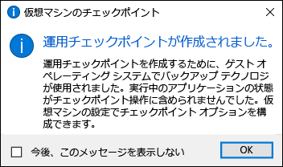

# <a name="using-checkpoints-to-revert-virtual-machines-to-a-previous-state"></a>チェックポイントを使用して仮想マシンを以前の状態に戻す

仮想化の主な利点の 1 つは、仮想マシンの状態を容易に保存できる機能です。 Hyper-V では、仮想マシンのチェックポイントを使用して実行します。 ソフトウェア構成を変更したり、ソフトウェアの更新を適用したり、または新しいソフトウェアをインストールしたりする前に、仮想マシンのチェックポイントを作成する場合があります。 システムの変更が問題の原因となる場合、仮想マシンはチェックポイント取得時の状態に戻されている可能性があります。

Windows 10 Hyper-V には、次の 2 種類のチェックポイントが含まれています。

* **標準的なチェックポイント**: チェックポイントが開始時の仮想マシンのメモリ状態、仮想マシンのスナップショットを取得します。 スナップショットは完全なバックアップではなく、ノード間でデータをレプリケートするシステム (たとえば Active Directory) でのデータ整合性に関する問題の原因となることがあります。  Windows 10 より前の Hyper-V で提供されていたのは、標準のチェックポイントのみでした (以前はスナップショットと呼ばれていました)。

* **生産チェックポイント**: 仮想マシンの一貫性のあるデータのバックアップを作成するのには、Linux 仮想マシンのボリューム シャドウ コピー サービスまたはシステムを固定してファイルを使用します。 仮想マシンのメモリの状態のスナップショットは取得されません。

運用チェックポイントは既定で選択されていますが、Hyper-V マネージャーまたは PowerShell のいずれかを使用して変更することができます。

> **注:** Hyper-V PowerShell モジュールには、チェックポイントとスナップショットを置き換えて使用できるように、いくつかのエイリアスが用意されています。  
  このドキュメントではチェックポイントを使用していますが、類似のコマンドにスナップショットという用語が使用される場合があることに注意してください。

## <a name="changing-the-checkpoint-type"></a>チェックポイントの種類の変更

**Hyper-V マネージャーの使用**

1. Hyper-V マネージャーを開きます。
2. 仮想マシンを右クリックして、**[設定]** を選択します。
3. [管理] で **[チェックポイント]** を選択します。
4. 必要なチェックポイントの種類を選択します。

<br />


**PowerShell を使用する**

PowerShell では、次のコマンドを実行してチェックポイントを変更できます。 

標準チェックポイントに設定するには、次のコマンドを使用します。
```powershell
Set-VM -Name <vmname> -CheckpointType Standard
```

運用チェックポイントに設定するには、次のコマンドを使用します。運用チェックポイントの設定に失敗した場合、標準のチェックポイントが作成されます。
```powershell
Set-VM -Name <vmname> -CheckpointType Production
```

運用チェックポイントに設定するには、次のコマンドを使用します。運用チェックポイントの設定に失敗した場合、標準のチェックポイントは作成されません。 
```powershell
Set-VM -Name <vmname> -CheckpointType ProductionOnly
```

## <a name="creating-checkpoints"></a>チェックポイントの作成

仮想マシン用に構成された種類のチェックポイントを作成します。 この種類を変更する方法の手順については、このドキュメントで既に説明した「[チェックポイントの種類の構成](checkpoints.md#changing-the-checkpoint-type)」セクションをご覧ください。

**Hyper-V マネージャーの使用**

チェックポイントを作成するには、次の手順を実行します。  
1. Hyper-V マネージャーで、仮想マシンを選択します。
2. 仮想マシンの名前を右クリックし、**[チェックポイント]** をクリックします。
3. プロセスが完了すると、**Hyper-V マネージャー**の **[チェックポイント]** の下にチェックポイントが表示されます。

**PowerShell を使用する**

**CheckPoint-VM** コマンドを使用して、チェックポイントを作成します。  

```powershell
Checkpoint-VM -Name <VMName>
```

チェックポイントの処理が完了したときに仮想マシンのチェックポイントの一覧を表示するには、**Get-VMCheckpoint** コマンドを使用します。

```powershell
Get-VMCheckpoint -VMName <VMName>
```

## <a name="applying-checkpoints"></a>チェックポイントの適用

仮想マシンを前の時点に戻す場合に、既存のチェックポイントを適用できます。

**Hyper-V マネージャーの使用**

1.  **Hyper-V マネージャー**の **[仮想マシン]** の下で仮想マシンを選択します。
2.  [チェックポイント] セクションで、使用するチェックポイントを右クリックし、**[適用]** をクリックします。
3.  次のオプションを示すダイアログ ボックスが表示されます。  
  * **[チェックポイントを作成して適用]**: 以前のチェックポイントを適用する前に仮想マシンの新しいチェックポイントを作成します。 
  * **[適用]**: 選択したチェックポイントのみを適用します。 この操作を取り消すことはできません。
  * **[キャンセル]**: 何もせずにダイアログ ボックスを閉じます。
  
  チェックポイントを作成して適用するには、いずれかの適用オプションを選択してください。

**PowerShell を使用する**

5. 仮想マシンのチェックポイントの一覧を表示するには、**Get-VMCheckpoint** コマンドを使用します。

    ```powershell
    Get-VMCheckpoint -VMName <VMName>
    ```
6. チェックポイントを適用するには、**Restore-VMCheckpoint** コマンドを使用します。

    ```powershell
    Restore-VMCheckpoint -Name <checkpoint name> -VMName <VMName> -Confirm:$false
    ```

## <a name="renaming-checkpoints"></a>チェックポイントの名前変更

多くのチェックポイントは、決まった時点で作成されます。  識別名を追加すると、チェックポイントが作成されたときに、システムの状態の詳細を保存しやすきます。

既定では、チェックポイントの名前は、仮想マシンの名前とチェックポイントが作成された日時とを組み合わせた名前になります。 これは、標準の形式です。 

```
virtual_machine_name (MM/DD/YYY -hh:mm:ss AM\PM)
```

名前は 100 文字に制限されており、空白にすることはできません。 

**Hyper-V マネージャーの使用**

1.  **Hyper-V マネージャー**で、仮想マシンを選択します。
2.  チェックポイントを右クリックし、**[名前の変更]** を選択します。
3.  チェックポイントの新しい名前を入力します。 100 文字未満をする必要があり、フィールドを空にすることはできません。
4.  終了したら、**Enter** キーを押します。

**PowerShell を使用する**

``` powershell
Rename-VMCheckpoint -VMName <virtual machine name> -Name <checkpoint name> -NewName <new checkpoint name>
```

## <a name="deleting-checkpoints"></a>チェックポイントの削除

チェックポイントを削除すると、Hyper-V ホストの領域を解放することができます。

チェックポイントの実体は、.avhdx ファイルとして仮想マシンの .vhdx ファイルと同じ場所に保存されます。 .avhdx ファイルと .vhdx ファイルは、チェックポイントを削除するときに Hyper-V によって自動的にマージされます。  完了すると、チェックポイントの .avhdx ファイルがファイル システムから削除されます。 

.avhdx ファイルを直接削除しないでください。
 
**Hyper-V マネージャーの使用**

チェックポイントを正常に削除するには、次の手順を実行します。 

1.  **Hyper-V マネージャー**で、仮想マシンを選択します。
2.  **チェックポイント**] セクションを削除し、[削除] をクリックするチェックポイントを右クリックします。 チェックポイントと後続のすべてのチェックポイントを削除することもできます。 これを行うには、削除する最初のチェックポイントを右クリックして、******[チェックポイントのサブツリーを削除]** をクリックします。
3.  チェックポイントを削除することを確認するように求められる場合があります。 正しいチェックポイントであることを確認したら、**[削除]** をクリックします。 
 
**PowerShell を使用する**
```powershell
Remove-VMCheckpoint -VMName <virtual machine name> -Name <checkpoint name>
```

## <a name="exporting-checkpoints"></a>チェックポイントのエクスポート

エクスポートは、チェックポイントを別の場所に移動できるように仮想マシンとしてまとめる処理です。 そのチェックポイントをインポートすると、仮想マシンとして復元されます。 エクスポートされたチェックポイントは、バックアップに使用できます。

**PowerShell を使用**
``` powershell
Export-VMCheckpoint -VMName <virtual machine name> -Name <checkpoint name> -Path <path for export>
```

## <a name="enable-or-disable-checkpoints"></a>チェックポイントを有効または無効にする

1.  **Hyper-V マネージャー**で、仮想マシンの名前を右クリックして **[設定]** をクリックします。
2.  **[管理]** セクションで **[チェックポイント]** を選択します。
3.  この仮想マシンから除外する、チェックポイントを有効にするには選択かどうかを確認するチェックポイントを許可するには、は、これは既定の動作です。  
チェックポイントを無効にするには、**[チェックポイントを有効にする]** チェック ボックスをオフにします。
4.  **[適用]** をクリックして変更を適用します。 完了したら、**[OK]** をクリックしてダイアログ ボックスを閉じます。

## <a name="configure-checkpoint-location"></a>チェックポイントの場所を構成する

仮想マシンにチェックポイントがない場合は、チェックポイントの構成ファイルと保存状態ファイルが格納される場所を変更できます。

1.  **Hyper-V マネージャー**で、仮想マシンの名前を右クリックして **[設定]** をクリックします。    
2.  **[管理]** セクションで **[チェックポイント]** または **[チェックポイント ファイルの場所]** を選択します。  
4.  **[チェックポイント ファイルの場所]** で、ファイルを格納するフォルダーへのパスを入力します。  
5.  **[適用]** をクリックして変更を適用します。 完了したら、**[OK]** をクリックしてダイアログ ボックスを閉じます。

チェックポイントの構成ファイルは既定で、`%systemroot%\ProgramData\Microsoft\Windows\Hyper-V\Snapshots` に保存されます。


<!-- This belongs in dev docs

This folder will contain the .VMRS file with the runtime and saved state data and a .VMCX configuration file, which uses the checkpoint GUID as the file name.
-->

## <a name="checkpoint-demo"></a>チェックポイントのデモ

この演習では、チェックポイントを作成して適用する手順を、標準チェックポイントと運用チェックポイントのそれぞれについて説明します。  この例では、仮想マシンに単純な変更を加えて、動作の違いを観察します。 

### <a name="standard-checkpoint"></a>標準チェックポイント

1. 仮想マシンにログインして、デスクトップにテキスト ファイルを作成します。
2. メモ帳でファイルを開き、「これは標準チェックポイントです」というテキストを入力します。 **ファイルは保存せず、メモ帳も閉じないでください**。  
3. [こちら](checkpoints.md#changing-the-checkpoint-type)の手順に従ってチェックポイントを "標準" に変更します。
4. 新しいチェックポイントを作成します。

<br />
 

**Hyper-V マネージャーでの標準チェックポイントの適用**

これでチェックポイントが存在しますので、仮想マシンに変更を加えて、チェックポイントを適用し、仮想マシンを元の保存した状態に戻します。 

1. まだを開き、仮想マシンのデスクトップから削除する場合は、テキスト ファイルを閉じます。
2. Hyper-V マネージャーを開いて、標準チェックポイントを右クリックし、[適用] を選択します。
3. [チェックポイントの適用] の通知ウィンドウで [適用] を選択します。

<br />
 

チェックポイントが適用されると、テキスト ファイルが存在しているだけでなく、システムがチェックポイントの作成時とまったく同じ状態であることがわかります。 この例では、メモ帳が開かれており、テキスト ファイルが読み込まれました。

### <a name="production-checkpoint"></a>運用チェックポイント

運用チェックポイントを今すぐ調べてみましょう。 この処理は標準チェックポイントの操作とほぼ同じですが、少し異なる結果になります。 始める前に、仮想マシンがあり、チェックポイントの種類を運用チェックポイントに変更していることを確認します。

**仮想マシンの変更と運用チェックポイントの作成**

1. 仮想マシンにログオンし、新しいテキスト ファイルを作成します。 前の手順を実行している場合は、既存のテキスト ファイルを使用することができます。
2. 「これは運用チェックポイントです」と テキスト ファイルに入力して、このファイルを保存します。ただし、**メモ帳は閉じないでください**。
3. HYPER-V マネージャーを開く、仮想マシンを右クリックし、**チェックポイント**を選択します。
4. [運用チェックポイントが作成されました] ウィンドウで **[OK]** をクリックします。

<br />
 
    
**Hyper-V マネージャーでの運用チェックポイントの適用**

これでチェックポイントが存在しますので、システムに変更を加えて、チェックポイントを適用し、仮想マシンを元の保存した状態に戻します。 

1. まだを開き、仮想マシンのデスクトップから削除する場合は、テキスト ファイルを閉じます。
2. HYPER-V マネージャーを開く、運用チェックポイントを右クリックし、**適用**] を選択します。
3. [チェックポイントの適用] の通知ウィンドウで **[適用]** を選択します。

運用チェックポイントが適用されると、仮想マシンがオフの状態になっていることがわかります。

1. 起動して、仮想マシンにログインします。
2. テキスト ファイルが復元されていることを確認します。 ただし、標準チェックポイントとは異なり、メモ帳は開かれていません。   
