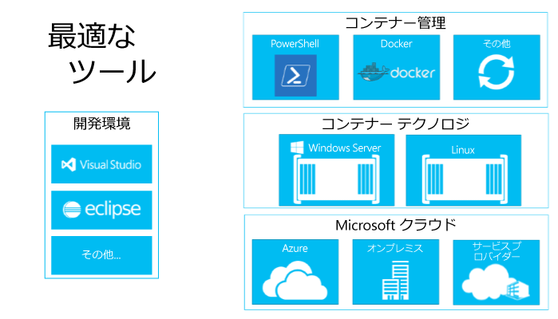

# コンテナー エコシステムの構築

コンテナーのエコシステムを構築が非常に重要な理由については、説明しましょう。 まず Docker です。

## Docker の魅力

コンテナー (名前空間の分離とリソース管理) の概念が経ちましたが、長時間 BSD の途中、Solaris ゾーンおよび UNIX chroot (ルートを変更する) の基本的なメカニズムに戻されることです。 行った Docker は、共通のツールセット、モデルのパッケージ化、および配置メカニズムを提供します。 これにより、Docker 大幅に簡略化、コンテナリゼーションとアプリケーションの配布します。 これらのアプリケーションで任意の Windows でも提供しています。 機能 Linux ホストは、どこにでも実行できます。

この一般的なテクノロジは、任意のホストに対して、同じ管理コマンドを提供することにより管理を合理化するだけでなく、シームレスな DevOps の貴重な機会も作成されます。

テスト マシンを一連の実稼働コンピューターの場合は、任意の環境全体にわたる秒単位で同じ展開は Docker のイメージを作成することができます開発者のデスクトップから。 この話は、大規模なが作成され、Docker を保持する、パブリック コンテナー詰めアプリケーション レジストリ DockerHub を使用して、Docker コンテナーでパッケージ化するアプリケーションのエコシステムを拡大します。

Docker では、開発のための優れた基盤を提供します。

これで、アプリケーションのエコシステムについて説明し、開発と展開のワークフローを作成する Docker 概念を構築する方法が、ニーズに合ったしましょう。

## コンテナー エコシステムのコンポーネント

Windows コンテナーは、大規模なコンテナー エコシステムの主要コンポーネントです。 ソリューション スタックの各層で開発者に選択肢を提供するため、業界全体で取り組んでいます。

コンテナーのエコシステムでは、コンテナーの管理、コンテナーの共有、およびコンテナーで実行されるアプリケーションを開発する方法を提供します。

Microsoft は、これらの次世代のアプリを構築すると、開発者の選択肢と生産性を高めるしようとしました。 この記事の目的では、変更、書き換える、またはコードを再構成することがなく、Microsoft のクラウドを対象とするアプリケーションを有効にするには、燃料開発者の生産性です。

マイクロソフトで開くと表示のエコシステムに努めています。 – Windows と Linux – などに役立つ革新の開発者のエコシステムを複数の同時受信積極的にサポートされています。

数か月後には、この開発中のエコシステムの追加パートナーに関する詳細を提供する予定です。

<!--HONumber=Feb16_HO4-->

