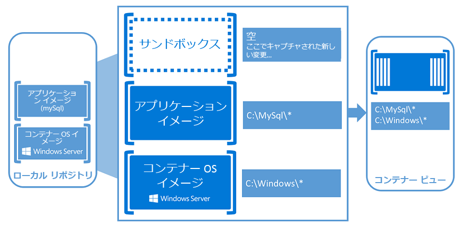

# Windows コンテナー

**この記事は暫定的な内容であり、変更される可能性があります。** 

アプリケーションは、クラウドおよびモバイル時代における革新を後押しします。 コンテナーおよびその周辺で発展をとげつつあるエコシステムによって、ソフトウェア開発者に次世代のアプリケーション エクスペリエンスを創造する力が与えられます。

簡単な概要については、こちらをご覧ください。: [Windows-based containers: Modern app development with enterprise-grade control](https://youtu.be/Ryx3o0rD5lY)(Windows ベースのコンテナー: エンタープライズ レベルの制御を使用した最新のアプリ開発)

## コンテナーとは

コンテナーは、分離され、リソースとして管理された、可搬性のある オペレーティング環境です。

基本的にコンテナーとは、システム内の他の箇所に影響を与えることなく、かつシステムからの影響を受けることもなく、アプリケーションが実行できる分離された場所です。 仮想化において、コンテナーは次の進化です。

コンテナーの内部は、まさに新規インストールされた物理コンピューターまたは仮想マシンの内部そのものに見えることでしょう。 また、[Docker](https://www.docker.com/) にとっては、他のコンテナーと同じ方法で Windows Server コンテナーを管理できます。

## Windows コンテナーの種類

Windows コンテナーには、2 つの異なるタイプのコンテナー (ランタイム) が含まれます。

**Windows Server コンテナー** – プロセスと名前空間の分離テクノロジを使用してアプリケーションを分離します。 Windows Server コンテナーでは、コンテナー ホストおよびそのホスト上で実行されているすべてのコンテナーとの間でカーネルを共有します。

**Hyper-V コンテナー** – 高度に最適化された仮想マシンで各コンテナーを実行することで、Windows Server コンテナーによって提供される分離性が拡張されます。 この構成では、コンテナー ホストのカーネルは Hyper-V コンテナーと共有されません。

## コンテナーの基礎

コンテナーでの作業を開始すると、コンテナーとバーチャル マシンの数多くの類似点に気付くでしょう。 コンテナーは、オペレーティング システムを実行し、ファイル システムを保有しています。物理または仮想コンピューター システムと同様に、ネットワーク経由でアクセスできます。 ただし、背景にあるテクノロジおよび概念は、コンテナーと仮想マシンとでは大きく異なります。  

Mark Russinovich による[このブログ記事](http://azure.microsoft.com/blog/2015/08/17/containers-docker-windows-and-trends/)では、コンテナーについてよく説明されています。

Windows コンテナーの作成と使用を開始する際には、次の主要な概念が役立ちます。 

**コンテナー ホスト:** Windows コンテナー機能を使用して構成された物理または仮想のコンピューター システム。 コンテナー ホストは、1 つ以上の Windows コンテナーを実行します。

**コンテナー イメージ:** ソフトウェアのインストールなどによってコンテナー ファイル システムまたはレジストリに変更が加えられると、それらの変更がサンドボックスでキャプチャされます。  これらの変更を継承する新しいコンテナーを作成できるように、この状態をキャプチャしたい場合がよくあります。 これこそがまさにイメージです。コンテナーが停止した後、サンドボックスを破棄するか、または新しいコンテナーのイメージに変換することができます。 たとえば、Windows Server のコア OS イメージからコンテナーをデプロイしたとします。 MySQL をこのコンテナーにインストールします。 このコンテナーから新しいイメージを作成すると、デプロイ可能なバージョンのコンテナーとして機能します。 このイメージには、追加された変更のみ (MySQL) が含まれますが、コンテナーの OS イメージの上位レイヤーとして機能します。

**サンドボックス:** コンテナーが起動すると、ファイル システムの変更、レジストリの変更、ソフトウェアのインストールなどのすべての書き込みアクションは、この "サンドボックス" レイヤーでキャプチャされます。  
 
**コンテナーの OS イメージ:** コンテナーは、イメージからデプロイされます。 潜在的に多数のイメージ レイヤーで構成されているコンテナーにおいて、コンテナーの OS イメージは第 1 レイヤーです。 このイメージは、オペレーティング システム環境を提供します。 コンテナーの OS イメージは変更不可で、これを変更することはできません。

**コンテナー リポジトリ:** コンテナー イメージが作成されるたびに、コンテナー イメージとその依存関係がローカル リポジトリに格納されます。 これらのイメージは、コンテナー ホストで何度も再利用できます。 コンテナー イメージは、多くの異なるコンテナー ホスト間で使用できるように、DockerHub などのパブリック レジストリまたはプライベート レジストリにも格納できます。

## 開発者のためのコンテナー

開発者のデスクトップから、テストマシン、さらには一連の実稼働マシンへと、わずか数秒でどのような環境にも同一のデプロイを行う Docker のイメージが作成できます。 これにより、DockerHub を使用して、大量かつ急増するアプリケーションのエコシステムが Docker コンテナーでパッケージ化されるようになりました。DockerHubは、Dockerが維持するパブリック コンテナ化アプリケーション レジストリで、現在 180,000 以上のアプリケーションをパブリック コミュニティ レジストリーで発行しています。  

アプリを コンテナ化する際に、アプリとアプリの実行に必要なコンポーネントのみが、「イメージ」に結合されます。 コンテナーは、必要に応じてこのイメージから作成されます。 イメージをベースラインとして使用してさらに別のイメージを作成し、イメージの作成をより高速にすることもできます。  複数のコンテナーで同じイメージを共有できるため、より少ないリソースを使用した非常に短時間でのコンテナーの起動が可能です。 たとえば、簡易で可搬性のある分散型アプリのアプリケーション コンポーネント (マイクロ サービス') のスピンアップにコンテナーを使用し、迅速に各サービスをスケールできます。

コンテナーにはアプリケーションの実行に必要なすべてがそろっているため高い可搬性があり、 Windows Server 2016 を実行している任意のコンピューター上で実行できます。 コンテナをローカルで作成してテストし、会社のプライベート クラウド、パブリック クラウドまたはサービス プロバイダーに同じコンテナーのイメージをデプロイすることができます。 コンテナーの持つ自然なアジリティは、大規模で仮想化されたクラウド環境で行われる現代のアプリ開発をサポートします。

コンテナーでは、開発者は任意の言語でアプリを構築できます。 これらのアプリは完全な可搬性があり、ラップトップ、デスクトップ、サーバー、プライベート クラウド、パブリック クラウドまたはサービス プロバイダーなど、任意の場所からコードを変更することなく実行できます。  

高品質なアプリケーションのより高速なビルドと出荷に、コンテナーが開発者を支援します。

## IT プロフェッショナル向けのコンテナー ##

IT プロフェッショナルは、コンテナーを使用して、開発、品質保証、および運用チームの標準化された環境を提供することができます。 もう複雑なインストールや構成手順について心配する必要はありません。 コンテナーを使用すると、システム管理者は、OS のインストールや基本となるインフラストラクチャから生じる違いを取り除くことができます

より簡単に更新や保守が可能なインフラストラクチャの作成に、コンテナーは管理者を支援します。

## 概要に関するビデオ

<iframe 
src="https://channel9.msdn.com/Blogs/containers/Containers-101-with-Microsoft-and-Docker/player" width="800" height="450" allowFullScreen="true" frameBorder="0" scrolling="no"></iframe>

## Windows Server のコンテナーをお試しください。

[コンテナーのクイック スタートの概要](../quick_start/quick_start.md)

<!--HONumber=Oct16_HO4-->

